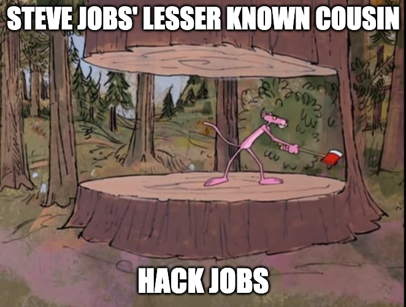

## Project Planning

I did not plan structure of project based on API research, as I saw nothing unusual in the API documentation.  So I expect I will simply implement API similarly to class / previous examples.

Project Plan:  Follow instructions, think about file structure and control flow, implement.

## Resources

https://www.typescriptlang.org/docs/handbook/2/objects.html
https://dmitripavlutin.com/typescript-index-signatures/
https://developer.mozilla.org/en-US/docs/Web/JavaScript/Reference/Operators/typeof
https://stackoverflow.com/questions/41639501/prevent-overriding-javascript-function
https://coreui.io/blog/how-to-round-a-number-to-two-decimal-places-in-javascript/
https://www.tax.ny.gov/pubs_and_bulls/tg_bulletins/st/taxable_receipt.htm
https://stackoverflow.com/questions/55447472/how-can-i-get-my-fetch-error-to-show-an-http-status-code
https://developer.mozilla.org/en-US/docs/Web/API/Response
https://developer.mozilla.org/en-US/docs/Web/HTTP/Reference/Status
