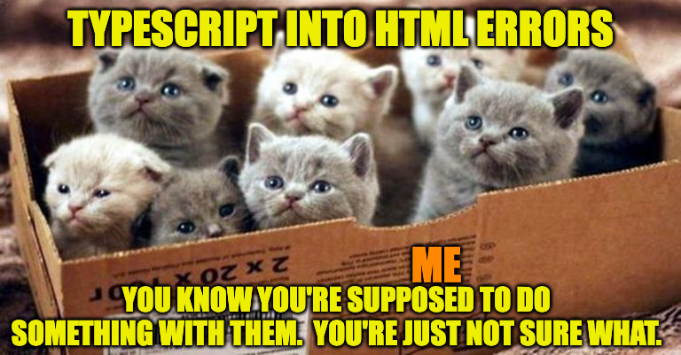

Sadly, Hack Jobs never knew why they lost points.  If only an instructor had made comments on what specifically was wrong (specific enough that specific errors could be identified)!  Repeatable errors could have been avoided!

Of course, that wouldn't have been as funny.

But when it comes to learning, perhaps repeatable errors and a lack of understanding of what really went wrong are less a matter for laughter, and more opportunities for growth.  Opportunities, say, that clear feedback can help unlock.

## Reflection

- TypeScript is about types.  I used them.  Specified parameter types, function return types, probably will use a type alias before finishing I shouldn't wonder, used index signatures for handling dynamic data.  OOP (object oriented programming) is implemented through use of classes with methods, creation of new instances of those classes, use of conceptual objects to organize, reference, and manipulate data.

- I didn't overcome the psychological challenge, as it's not within my ability to resolve the cause.  Bothered about losing earlier points on assignments and not knowing why I lost points as feedback wasn't given, or was not specific enough that I could identify specific issues.  It's like a black box function that you can't debug.  I can't even say I should adjust my thoughts on the matter; I think it's perfectly natural to want to know how to improve a process.  If I choose not to go to certain lengths to get points on an assignment that's a choice I make; if I lose points and don't know why that's just confusing.

- I handled async through async/await, as required by the assignment.  Handled errors using custom error and error handling function as specified by assignment.  Read up on error propagation to make sure my approach was correct; as I understand it I shouldn't pass an error up a chain, but handle it near to the point of origin so the trace is useful.  Of course, if I lose points I won't know if it's because an instructor just didn't like the way I handled errors or what it was.  It works perfectly fine as far as I understand matters; I'm fine to change practices if I know what to change, but if I don't know what to change, you can see how changing would be a problem.

## Project Planning

I did not plan structure of project based on API research, as I saw nothing unusual in the API documentation.  So I expect I will simply implement API similarly to class / previous examples.

Project Plan:  Follow instructions, think about file structure and control flow, implement.

## Resources

https://www.typescriptlang.org/docs/handbook/2/objects.html
https://dmitripavlutin.com/typescript-index-signatures/
https://developer.mozilla.org/en-US/docs/Web/JavaScript/Reference/Operators/typeof
https://stackoverflow.com/questions/41639501/prevent-overriding-javascript-function
https://coreui.io/blog/how-to-round-a-number-to-two-decimal-places-in-javascript/
https://www.tax.ny.gov/pubs_and_bulls/tg_bulletins/st/taxable_receipt.htm
https://stackoverflow.com/questions/55447472/how-can-i-get-my-fetch-error-to-show-an-http-status-code
https://developer.mozilla.org/en-US/docs/Web/API/Response
https://developer.mozilla.org/en-US/docs/Web/HTTP/Reference/Status
